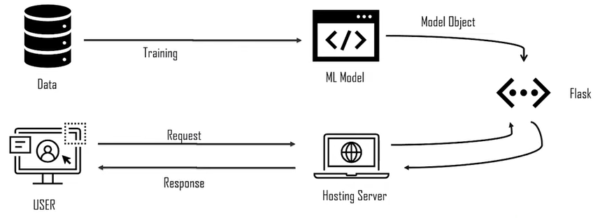
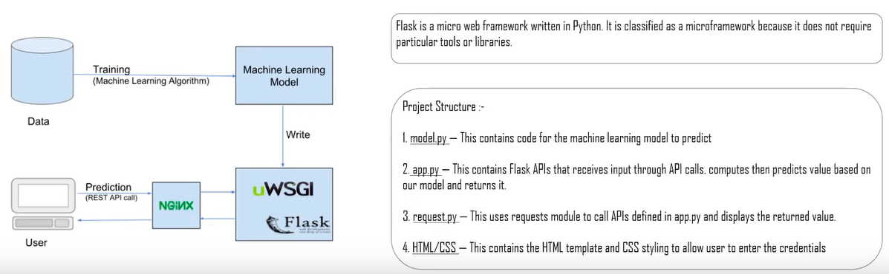
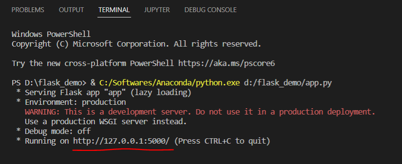
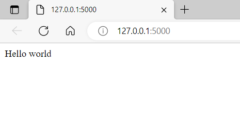
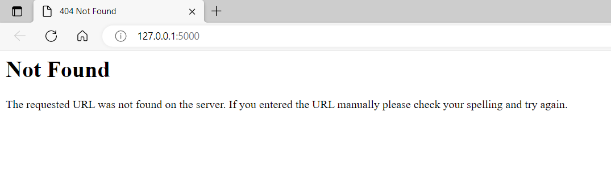
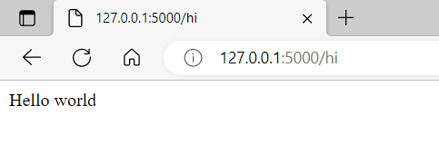

# ML Model Deployment With Flask On Heroku

__ML model deployment__ is the method by which you integrate a machine learning model into an existing production environment to make practical business decisions based on data.



The purpose of deploying your model is so that you can make the predictions from a trained ML model available to others, whether that be users, management or other systems. Model deployment is closely related to ML systems architecture, which refers to the arrangement and interactions of software components within a system to achieve a predefined goal. 

In this tutorial, we will be deploying our ML model on Heroku server.

## What is flask?

Flask is a web-framework, it means that Flask provides with tools, libraries and technologies that allows you to built web-applications. Flask is a category of micro-frameworks i.e, it has little to no dependency on external libraries. 

#### Pros of micro-frameworks:  
- Framework is light as little dependencies to update and watch out for bugs.

#### Cons of micro-frameworks:
- We have to work seperately to add some plugins i.e, more work.



Steps:
1. Activate your work env: `conda activate mlenv`
2. We can create a simple file `app.py`:

    ```
    from flask import Flask


    # creating an app

    app = Flask(__name__)  # create an object of flask

    @app.route("/")
    def hello():   # this can be any function
    return("Hello world")

    if __name__ == "__main__":
    app.run()  # if this script is run then run this app
    ```

3. Now if in the code line `@app.route("/")` we just use front slash then the app will be deployed locally in the default local url. On running the script:  
    

    

4. But if we change the code line to `@app.route("/hi")`. And re-run the script we will get the same output in terminal as:
    

    But in the webpage it will be page not found.

    

    So the parameter in the `@app.route()` is the extension. And whatever extension we give will get executed.

    


5. If we dont to re-run the code again and again we can use `app.run(debug = True)`.

